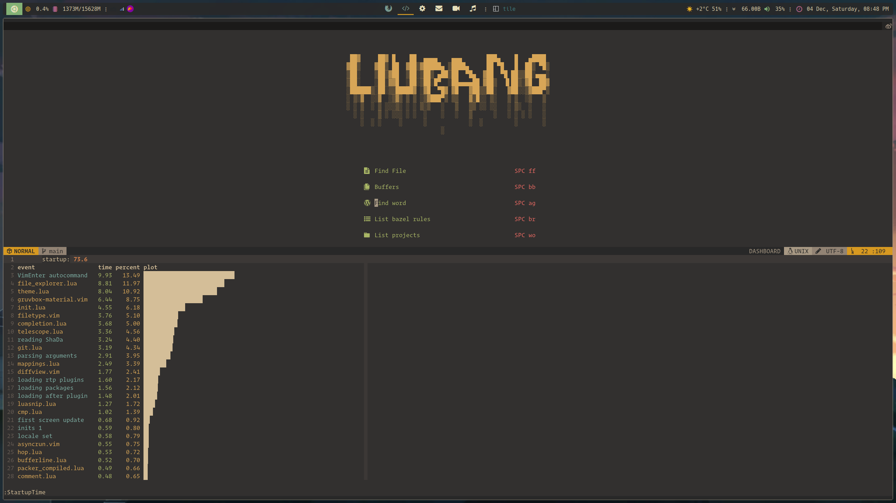
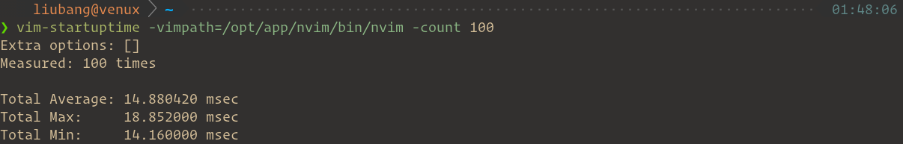

<h1 align="center">My Neovim Configuration</h1>

<div align="center"><p>
    <a href="https://github.com/neovim/neovim">
        
    </a>
    <a href="https://github.com/liubang/nvimrc/actions">
        
    </a>
    <a href="#">
        
    </a>
    <a href="https://github.com/liubang/nvimrc/pulse">
        
    </a>
    <a href="https://github.com/liubang/nvimrc/releases">
        
    </a>
    <a href="https://github.com/liubang/nvimrc/blob/main/LICENSE">
        
    </a>
</p></div>




## Features

- Fast. Less than **30ms** to start (Depends on SSD and CPU, tested on Intel NUC11BTMi9).
- Simple. Run out of the box.
- Modern. Pure lua to config.
- Powerful. Full functionality to code.



(Tested with [rhysd/vim-startuptime](https://github.com/rhysd/vim-startuptime))

## Requirements

- Neovim >= **0.8.2** (needs to be built with **LuaJIT**)
- Git >= **2.19.0** (for partial clones support)
- a [Nerd Font](https://www.nerdfonts.com/) **_(optional)_**

## Try out

If you have [Docker](https://www.docker.com/) on your system you can try out this config via docker

### Just start nvim

```bash
docker run -it --rm liubang/nvim
```

### Mount a local directory and start nvim

```bash
docker run -it --rm -v $(pwd):/home/neovim/workspace liubang/nvim
```
