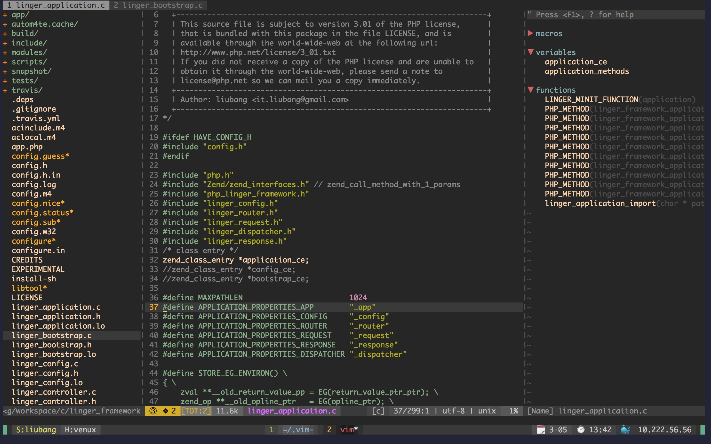

# vimrc

Configuration for neovim/vim8.




## Dependences 

Install [The Silver Searcher](https://github.com/ggreer/the_silver_searcher)

For Mac OS X:

```shell
brew install the_silver_searcher
brew install --HEAD universal-ctags/universal-ctags/universal-ctags
```

For Ubuntu

```shell
sudo apt-get install silversearcher-ag ctags
```

Install pip modules for your neovim python3

```shell
pip3 install --user neovim jedi psutil setproctitle
```

## For vim8

Install vim8 with python3 and lua support.

For Mac OS X:

```shell
brew install vim --with-python3 --with-lua --override-system-vim
```

For Linux/Unix:

Install dependencies

```shell
sudo apt install libncurses5-dev libgnome2-dev libgnomeui-dev \
    libgtk2.0-dev libatk1.0-dev libbonoboui2-dev clang\
    libcairo2-dev libx11-dev libxpm-dev libxt-dev python-dev \
    python3-dev ruby-dev lua5.1 lua5.1-dev libperl-dev git
```

Compile and install

```shell
cd ~
git clone https://github.com/vim/vim.git
cd vim
./configure --with-features=huge \
            --enable-multibyte \
            --enable-rubyinterp=yes \
            --enable-python3interp=yes \
            --with-python3-config-dir=/usr/lib/python3.6/config-x86_64-linux-gnu \
            --enable-perlinterp=yes \
            --enable-luainterp=yes \
            --enable-gui=gtk2 \
            --enable-cscope \
            --prefix=/usr/local
make VIMRUNTIMEDIR=/usr/local/share/vim/vim80
```

Then install configuration.

```shell
git clone https://github.com/iliubang/vimrc.git ~/.vim
ln -s ~/.vim/init.vim ~/.vimrc
```

## For neivim

```shell
git clone https://github.com/iliubang/vimrc.git ~/.vim
ln -s ~/.vim .config/nvim
```

## Custom configuration

```shell
cp ~/.vim.rc/vim.custom.template ~/.vim.custom
```

example:

```viml
function! CustomPlug()
    " add a component
    Component 'better'
    " or add a plugin
    Plug 'sickill/vim-monokai'
endfunction

function! CustomConfig()
    set t_Co=256
    set laststatus=2
    set background=dark
    colorscheme monokai
endfunction
```

## Usage

**About Leader Key**

The `<leader>` key is mapped to '\<Space>'.

### Main shortcut keys

| Command          | Description                                                         |
|------------------|---------------------------------------------------------------------|
| <leader>ff       | Search files in current path                                        |
| <leader>f?       | Search files in root path                                           |
| <leader>ft       | Toggle nerdtree                                                     |
| F4               | Toggle nerdtree                                                     |
| F3               | Toggle tagbar                                                       |
| <leader>tm       | Toggle vim table mode                                               |
| <leader>cc       | Comment out the current line or text selected in visual mode        |
| <leader>cu       | Uncomments the selected line(s)                                     |
| <leader>cn       | Same as cc but forces nesting                                       |
| <leader>c<space> | Toggles the comment state of the selected line(s)                   |
| <leader>cm       | Comments the given lines using only one set of multipart delimiters |
| zc               | Fold code                                                           |
| zo               | Unfold the code                                                     |
| za               | Toggle the folding state of code                                    |
| zm               | Unfold all                                                          |
| zr               | Fold all                                                            |

## Plugins

### nerdtree

@See: [https://github.com/scrooloose/nerdtree/blob/master/doc/NERDTree.txt](https://github.com/scrooloose/nerdtree/blob/master/doc/NERDTree.txt)


### nerdcommenter

@See: [https://github.com/scrooloose/nerdcommenter](https://github.com/scrooloose/nerdcommenter)
