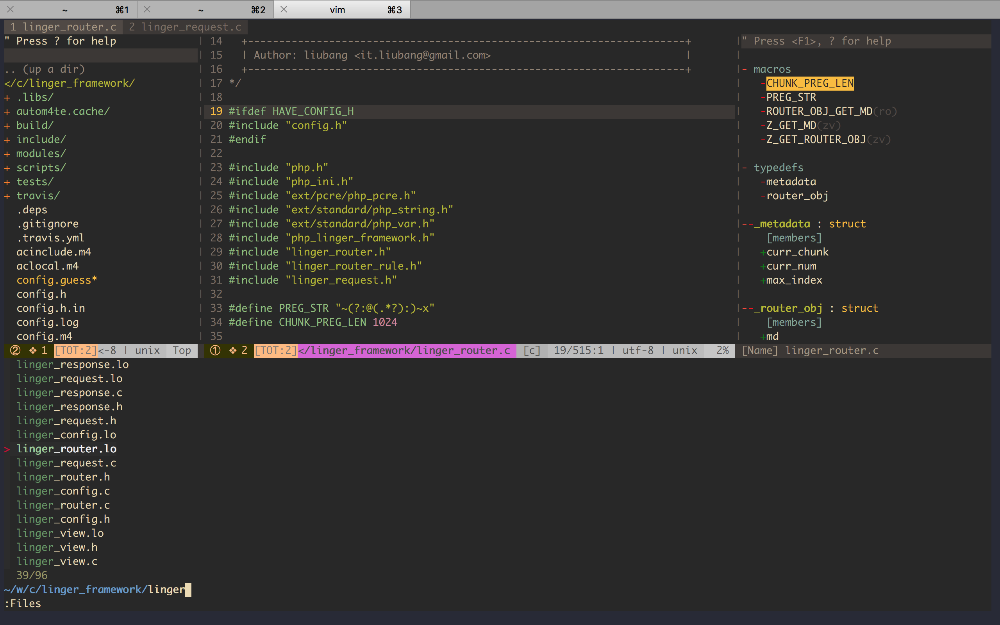

# vimrc
my private vim configuration.





## install 

```shell
git clone https://github.com/iliubang/vimrc.git ~/.vim.rc
ln -s ~/.vim.rc/init.vim ~/.vimrc
vim +PlugInstall +qa
```

## Usage

**About Leader Key**

The `<leader>` key is mapped to '\<Space>'.

### Main shortcut keys

```
| Command          | Description                                                         |
|------------------+---------------------------------------------------------------------|
| <leader>ff       | Search files in current path                                        |
| <leader>f?       | Search files in root path                                           |
| <leader>ft       | Toggle nerdtree                                                     |
| F4               | Toggle nerdtree                                                     |
| <leader>tm       | Toggle vim table mode                                               |
| <leader>cc       | Comment out the current line or text selected in visual mode        |
| <leader>cu       | Uncomments the selected line(s)                                     |
| <leader>cn       | Same as cc but forces nesting                                       |
| <leader>c<space> | Toggles the comment state of the selected line(s)                   |
| <leader>cm       | Comments the given lines using only one set of multipart delimiters |
```

## Plugins

### nerdtree

@See: [https://github.com/scrooloose/nerdtree/blob/master/doc/NERDTree.txt](https://github.com/scrooloose/nerdtree/blob/master/doc/NERDTree.txt)


```
2.3. NERD tree Mappings                                     *NERDTreeMappings*

Default  Description~                                             help-tag~
Key~

o.......Open files, directories and bookmarks....................|NERDTree-o|
go......Open selected file, but leave cursor in the NERDTree.....|NERDTree-go|
t.......Open selected node/bookmark in a new tab.................|NERDTree-t|
T.......Same as 't' but keep the focus on the current tab........|NERDTree-T|
i.......Open selected file in a split window.....................|NERDTree-i|
gi......Same as i, but leave the cursor on the NERDTree..........|NERDTree-gi|
s.......Open selected file in a new vsplit.......................|NERDTree-s|
gs......Same as s, but leave the cursor on the NERDTree..........|NERDTree-gs|
O.......Recursively open the selected directory..................|NERDTree-O|
x.......Close the current nodes parent...........................|NERDTree-x|
X.......Recursively close all children of the current node.......|NERDTree-X|
e.......Edit the current dir.....................................|NERDTree-e|

<CR>...............same as |NERDTree-o|.
double-click.......same as the |NERDTree-o| map.
middle-click.......same as |NERDTree-i| for files, same as
                   |NERDTree-e| for dirs.

D.......Delete the current bookmark .............................|NERDTree-D|

P.......Jump to the root node....................................|NERDTree-P|
p.......Jump to current nodes parent.............................|NERDTree-p|
K.......Jump up inside directories at the current tree depth.....|NERDTree-K|
J.......Jump down inside directories at the current tree depth...|NERDTree-J|
<C-J>...Jump down to the next sibling of the current directory...|NERDTree-C-J|
<C-K>...Jump up to the previous sibling of the current directory.|NERDTree-C-K|

C.......Change the tree root to the selected dir.................|NERDTree-C|
u.......Move the tree root up one directory......................|NERDTree-u|
U.......Same as 'u' except the old root node is left open........|NERDTree-U|
r.......Recursively refresh the current directory................|NERDTree-r|
R.......Recursively refresh the current root.....................|NERDTree-R|
m.......Display the NERD tree menu...............................|NERDTree-m|
cd......Change the CWD to the dir of the selected node...........|NERDTree-cd|
CD......Change tree root to the CWD..............................|NERDTree-CD|

I.......Toggle whether hidden files displayed....................|NERDTree-I|
f.......Toggle whether the file filters are used.................|NERDTree-f|
F.......Toggle whether files are displayed.......................|NERDTree-F|
B.......Toggle whether the bookmark table is displayed...........|NERDTree-B|

q.......Close the NERDTree window................................|NERDTree-q|
A.......Zoom (maximize/minimize) the NERDTree window.............|NERDTree-A|
?.......Toggle the display of the quick help.....................|NERDTree-?|

------------------------------------------------------------------------------
                                                                  *NERDTree-o*
```

### nerdcommenter

@See: [https://github.com/scrooloose/nerdcommenter](https://github.com/scrooloose/nerdcommenter)
