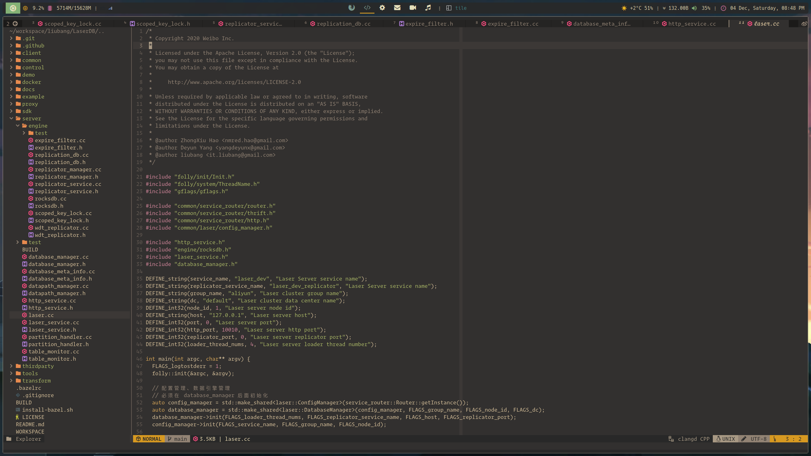
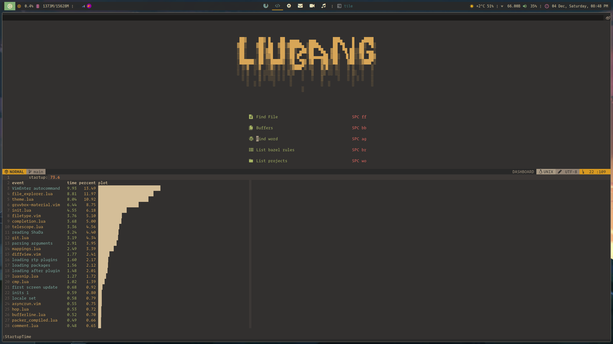
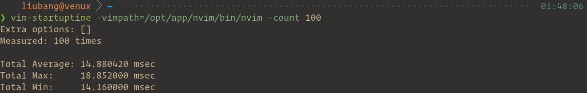

<h1 align="center">Neovim Configuration</h1>

<div align="center"><p>
    <a href="https://github.com/neovim/neovim">
        
    </a>
    <a href="https://github.com/liubang/nvimrc/actions">
        
    </a>
    <a href="#">
        
    </a>
    <a href="https://github.com/liubang/nvimrc/releases">
        
    </a>
    <a href="https://github.com/liubang/nvimrc/blob/main/LICENSE">
        
    </a>
</p></div>

<p align="center">A fast, practical, and fully Lua-based Neovim setup for day-to-day development.</p>



## Overview

This repository contains my personal Neovim configuration, shaped around a few goals:

- Fast startup and responsive editing.
- Sensible defaults that work out of the box.
- A modern Lua-first configuration built on top of `lazy.nvim`.
- Useful tooling for real projects, including LSP, Telescope, Git, debugging, Markdown, Java, and Bazel workflows.
- Auto-generated documentation for keymaps and installed plugins so the README stays in sync with the config.

Startup time is typically under **30 ms** on a modern machine. That number depends on your hardware, filesystem, and plugin state. The original measurements were taken with [rhysd/vim-startuptime](https://github.com/rhysd/vim-startuptime).

## Table of Contents

- [Overview](#overview)
- [Requirements](#requirements)
- [Quick Start](#quick-start)
- [Local Installation](#local-installation)
- [What You Get](#what-you-get)
- [Screenshots](#screenshots)
- [Keymaps](#keymaps)
- [Plugins](#plugins)

## Requirements

Required:

- Neovim >= **0.11.0** with **LuaJIT**
- Git >= **2.19.0** for partial clone support
- A [Nerd Font](https://www.nerdfonts.com/)

Recommended:

- `ripgrep` for fast project search
- `fd` for better file discovery in Telescope pickers
- Language-specific tools you already use locally, such as LSP servers, formatters, DAP adapters, Java runtimes, or Bazel

## Quick Start

If you want to try the configuration without touching your local setup, run it with [Docker](https://www.docker.com/):

### Start Neovim in a container

```bash
docker run -it --rm liubang/nvim
```

### Open a local project inside the container

```bash
docker run -it --rm -v "$(pwd)":/home/neovim/workspace liubang/nvim
```

## Local Installation

Clone this repository into your Neovim config directory:

```bash
git clone https://github.com/liubang/nvimrc ~/.config/nvim
nvim
```

If you already have a Neovim configuration, back it up first:

```bash
mv ~/.config/nvim ~/.config/nvim.bak
git clone https://github.com/liubang/nvimrc ~/.config/nvim
nvim
```

On first launch, `lazy.nvim` will install the configured plugins automatically.

## What You Get

- Editor UX: bufferline, statusline, file explorers, surrounding/comment helpers, and smooth motion/navigation improvements.
- Project navigation: Telescope, live grep, recent files, task pickers, and outline views.
- Coding support: Treesitter, LSP, completion, snippets, formatting, and diagnostics.
- Git workflow: signs, blame, diff views, and buffer-aware navigation.
- Debugging: `nvim-dap` with keymaps for breakpoints, stepping, REPL, and widgets.
- Language extras: dedicated support for Java, Markdown, LaTeX, and a few personal productivity plugins.

## Screenshots





## Notes

The `Keymaps` and `Plugins` sections below are generated from the actual configuration, which helps keep the documentation accurate as the setup evolves.

## Keymaps

<!-- keymaps:start -->

| Key          | Description                                                                                                         | Mode                |
| ------------ | ------------------------------------------------------------------------------------------------------------------- | ------------------- |
| `n`          | Next search result                                                                                                  | **n**, **x**, **o** |
| `N`          | Previous search result                                                                                              | **n**, **x**, **o** |
| `<S-j>`      | Move lines down                                                                                                     | **n**, **x**        |
| `<S-k>`      | Move lines up                                                                                                       | **n**, **x**        |
| `<Esc><Esc>` | Clear hlsearch                                                                                                      | **n**               |
| `/`          | Search in visually selected region                                                                                  | **x**               |
| `<`          | Keep the visually selected area when indenting                                                                      | **x**               |
| `>`          | Keep the visually selected area when indenting                                                                      | **x**               |
| `p`          | Replace the selection without overwriting the default register                                                      | **x**               |
| `<Leader>bp` | Previous                                                                                                            | **n**               |
| `<Leader>bn` | Next                                                                                                                | **n**               |
| `<Leader>bf` | First                                                                                                               | **n**               |
| `<Leader>bl` | Last                                                                                                                | **n**               |
| `<Leader>ww` | Toggle between open windows                                                                                         | **n**               |
| `<leader>wd` | Delete window                                                                                                       | **n**               |
| `<Leader>wh` | Move to the left window                                                                                             | **n**               |
| `<Leader>wl` | Move to the right window                                                                                            | **n**               |
| `<Leader>wj` | Move to the bottom window                                                                                           | **n**               |
| `<Leader>wk` | Move to the top window                                                                                              | **n**               |
| `<Leader>ws` | Split window horizontally                                                                                           | **n**               |
| `<Leader>wv` | Split window vertically                                                                                             | **n**               |
| `<C-Up>`     | Increase window height                                                                                              | **n**               |
| `<C-Down>`   | Decrease window height                                                                                              | **n**               |
| `<C-Left>`   | Decrease window width                                                                                               | **n**               |
| `<C-Right>`  | Increase window width                                                                                               | **n**               |
| `j`          | Accelerated j                                                                                                       | **n**, **x**, **o** |
| `k`          | Accelerated k                                                                                                       | **n**, **x**, **o** |
| `<C-b>`      | [asynctasks.vim](https://github.com/skywind3000/asynctasks.vim.git) Build current file                              | **n**               |
| `<C-r>`      | [asynctasks.vim](https://github.com/skywind3000/asynctasks.vim.git) Run current file                                | **n**               |
| `<C-x>`      | [asynctasks.vim](https://github.com/skywind3000/asynctasks.vim.git) Build and run current file                      | **n**               |
| `<Leader>fm` | [conform.nvim](https://github.com/stevearc/conform.nvim.git) Format buffer                                          | **n**, **v**        |
| `s`          | [flash.nvim](https://github.com/folke/flash.nvim.git) Flash                                                         | **n**, **x**, **o** |
| `S`          | [flash.nvim](https://github.com/folke/flash.nvim.git) Flash Treesitter                                              | **n**, **x**, **o** |
| `r`          | [flash.nvim](https://github.com/folke/flash.nvim.git) Remote Flash                                                  | **o**               |
| `R`          | [flash.nvim](https://github.com/folke/flash.nvim.git) Treesitter Search                                             | **o**, **x**        |
| `]h`         | [gitsigns.nvim](https://github.com/lewis6991/gitsigns.nvim.git) Next hunk                                           | **n**               |
| `[h`         | [gitsigns.nvim](https://github.com/lewis6991/gitsigns.nvim.git) Prev hunk                                           | **n**               |
| `<Leader>hs` | [gitsigns.nvim](https://github.com/lewis6991/gitsigns.nvim.git) Stage the hunk at the cursor position               | **n**               |
| `<Leader>hr` | [gitsigns.nvim](https://github.com/lewis6991/gitsigns.nvim.git) Reset the lines of the hunk at the cursor position  | **n**               |
| `<leader>sr` | [grug-far.nvim](https://github.com/MagicDuck/grug-far.nvim.git) Search and Replace                                  | **n**, **v**        |
| `gc`         | [mini.comment](https://github.com/nvim-mini/mini.comment.git) Toggle line comment                                   | **n**, **x**        |
| `gcc`        | [mini.comment](https://github.com/nvim-mini/mini.comment.git) Toggle line comment                                   | **n**               |
| `-`          | [mini.files](https://github.com/nvim-mini/mini.files.git) Open mini.files (parent directory)                        | **n**               |
| `<leader>ft` | [mini.files](https://github.com/nvim-mini/mini.files.git) Toggle mini.files (Directory of Current File)             | **n**               |
| `<leader>fT` | [mini.files](https://github.com/nvim-mini/mini.files.git) Toggle mini.files (cwd)                                   | **n**               |
| `<Leader>tl` | [outline.nvim](https://github.com/hedyhli/outline.nvim.git) Open or close the outline window                        | **n**               |
| `<Leader>mp` | [peek.nvim](https://github.com/toppair/peek.nvim.git) Markdown Preview                                              | **n**               |
| `<Leader>ff` | [snacks.nvim](https://github.com/folke/snacks.nvim.git) Find files                                                  | **n**               |
| `<Leader>rf` | [snacks.nvim](https://github.com/folke/snacks.nvim.git) Recent files                                                | **n**               |
| `<Leader>ag` | [snacks.nvim](https://github.com/folke/snacks.nvim.git) Live grep in files                                          | **n**               |
| `<Leader>Ag` | [snacks.nvim](https://github.com/folke/snacks.nvim.git) Search for string under cursor                              | **n**, **x**        |
| `<Leader>bb` | [snacks.nvim](https://github.com/folke/snacks.nvim.git) List open buffers                                           | **n**               |
| `<leader>bd` | [snacks.nvim](https://github.com/folke/snacks.nvim.git) Delete buffer                                               | **n**               |
| `<leader>bD` | [snacks.nvim](https://github.com/folke/snacks.nvim.git) Delete buffer (force)                                       | **n**               |
| `<Leader>br` | [snacks.nvim](https://github.com/folke/snacks.nvim.git) Bazel run                                                   | **n**               |
| `<Leader>bt` | [snacks.nvim](https://github.com/folke/snacks.nvim.git) Bazel test                                                  | **n**               |
| `<Leader>bs` | [snacks.nvim](https://github.com/folke/snacks.nvim.git) Bazel build                                                 | **n**               |
| `<Leader>ts` | [snacks.nvim](https://github.com/folke/snacks.nvim.git) AsyncTasks                                                  | **n**               |
| `<Leader>sb` | [snacks.nvim](https://github.com/folke/snacks.nvim.git) Buffer lines                                                | **n**               |
| `<Leader>gf` | [snacks.nvim](https://github.com/folke/snacks.nvim.git) Git files                                                   | **n**               |
| `<Leader>gs` | [snacks.nvim](https://github.com/folke/snacks.nvim.git) Git status                                                  | **n**               |
| `<Leader>gl` | [snacks.nvim](https://github.com/folke/snacks.nvim.git) Git log                                                     | **n**               |
| `<Leader>gL` | [snacks.nvim](https://github.com/folke/snacks.nvim.git) Git log (current file)                                      | **n**               |
| `<Leader>gh` | [snacks.nvim](https://github.com/folke/snacks.nvim.git) Git log (current line)                                      | **n**               |
| `<Leader>gv` | [snacks.nvim](https://github.com/folke/snacks.nvim.git) Git diff (hunks)                                            | **n**               |
| `<Leader>gb` | [snacks.nvim](https://github.com/folke/snacks.nvim.git) Git branches                                                | **n**               |
| `<C-t>`      | [toggleterm.nvim](https://github.com/akinsho/toggleterm.nvim.git) Toggle terminal                                   | **n**               |
| `<C-v>`      | [tree-sitter-manager.nvim](https://github.com/romus204/tree-sitter-manager.nvim.git) Treesitter Increment Selection | **n**               |
| `V`          | [tree-sitter-manager.nvim](https://github.com/romus204/tree-sitter-manager.nvim.git) Treesitter Decrement Selection | **x**               |
| `<leader>vv` | [venn.nvim](https://github.com/jbyuki/venn.nvim.git) Toggle draw box                                                | **n**               |

<!-- keymaps:end -->

## Plugins

<!-- plugins:start -->

- [asyncrun.vim](https://github.com/skywind3000/asyncrun.vim)
- [asynctasks.vim](https://github.com/skywind3000/asynctasks.vim)
- [autoclose.nvim](https://github.com/m4xshen/autoclose.nvim)
- [blink.cmp](https://github.com/saghen/blink.cmp)
- [blink.lib](https://github.com/saghen/blink.lib)
- [conform.nvim](https://github.com/stevearc/conform.nvim)
- [everforest](https://github.com/sainnhe/everforest)
- [fidget.nvim](https://github.com/j-hui/fidget.nvim)
- [flash.nvim](https://github.com/folke/flash.nvim)
- [friendly-snippets](https://github.com/rafamadriz/friendly-snippets)
- [gitsigns.nvim](https://github.com/lewis6991/gitsigns.nvim)
- [grug-far.nvim](https://github.com/MagicDuck/grug-far.nvim)
- [gruvbox-material](https://github.com/sainnhe/gruvbox-material)
- [lazy.nvim](https://github.com/folke/lazy.nvim)
- [lazydev.nvim](https://github.com/folke/lazydev.nvim)
- [lualine.nvim](https://github.com/nvim-lualine/lualine.nvim)
- [LuaSnip](https://github.com/L3MON4D3/LuaSnip)
- [mason-lspconfig.nvim](https://github.com/mason-org/mason-lspconfig.nvim)
- [mason.nvim](https://github.com/mason-org/mason.nvim)
- [mini.align](https://github.com/nvim-mini/mini.align)
- [mini.comment](https://github.com/nvim-mini/mini.comment)
- [mini.cursorword](https://github.com/nvim-mini/mini.cursorword)
- [mini.files](https://github.com/nvim-mini/mini.files)
- [mini.icons](https://github.com/nvim-mini/mini.icons)
- [mini.surround](https://github.com/nvim-mini/mini.surround)
- [mini.tabline](https://github.com/nvim-mini/mini.tabline)
- [neogen](https://github.com/danymat/neogen)
- [nui.nvim](https://github.com/MunifTanjim/nui.nvim)
- [nvim-dap](https://github.com/mfussenegger/nvim-dap)
- [nvim-highlight-colors](https://github.com/brenoprata10/nvim-highlight-colors)
- [nvim-java](https://github.com/nvim-java/nvim-java)
- [nvim-lint](https://github.com/mfussenegger/nvim-lint)
- [nvim-lspconfig](https://github.com/neovim/nvim-lspconfig)
- [nvim-navic](https://github.com/SmiteshP/nvim-navic)
- [nvim-nio](https://github.com/nvim-neotest/nvim-nio)
- [outline.nvim](https://github.com/hedyhli/outline.nvim)
- [peek.nvim](https://github.com/toppair/peek.nvim)
- [plenary.nvim](https://github.com/nvim-lua/plenary.nvim)
- [schemastore.nvim](https://github.com/b0o/schemastore.nvim)
- [snacks.nvim](https://github.com/folke/snacks.nvim)
- [spring-boot.nvim](https://github.com/JavaHello/spring-boot.nvim)
- [tla.nvim](https://github.com/liubang/tla.nvim)
- [toggleterm.nvim](https://github.com/akinsho/toggleterm.nvim)
- [tree-sitter-manager.nvim](https://github.com/romus204/tree-sitter-manager.nvim)
- [venn.nvim](https://github.com/jbyuki/venn.nvim)
- [vim-caser](https://github.com/arthurxavierx/vim-caser)
- [vim-diagon](https://github.com/willchao612/vim-diagon)
- [vim-matchup](https://github.com/andymass/vim-matchup)
- [vimtex](https://github.com/lervag/vimtex)

<!-- plugins:end -->
