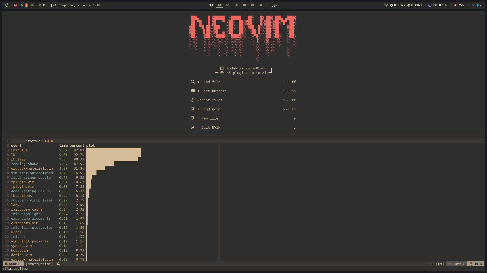

<h1 align="center">My Neovim Configuration</h1>

<div align="center"><p>
    <a href="https://github.com/neovim/neovim">
        
    </a>
    <a href="https://github.com/liubang/nvimrc/actions">
        
    </a>
    <a href="#">
        
    </a>
    <a href="https://github.com/liubang/nvimrc/releases">
        
    </a>
    <a href="https://github.com/liubang/nvimrc/blob/main/LICENSE">
        
    </a>
</p></div>




## Features

- Fast. Less than **30ms** to start (Depends on SSD and CPU, tested on Intel NUC11BTMi9).
- Simple. Run out of the box.
- Modern. Pure lua to config.
- Powerful. Full functionality to code.


(Tested with [rhysd/vim-startuptime](https://github.com/rhysd/vim-startuptime))

## Requirements

- Neovim >= **0.9.4** (needs to be built with **LuaJIT**)
- Git >= **2.19.0** (for partial clones support)
- a [Nerd Font](https://www.nerdfonts.com/)

## Getting Started

If you have [Docker](https://www.docker.com/) on your system you can try out this config via docker

### Just start nvim

```bash
docker run -it --rm liubang/nvim
```

### Mount a local directory and start nvim

```bash
docker run -it --rm -v $(pwd):/home/neovim/workspace liubang/nvim
```

## Keymaps

<!-- keymaps:start -->

| Key          | Description                                                                                                                 | Mode                |
| ------------ | --------------------------------------------------------------------------------------------------------------------------- | ------------------- |
| `n`          | Next search result                                                                                                          | **n**, **x**, **o** |
| `N`          | Prev search result                                                                                                          | **n**, **x**, **o** |
| `<S-j>`      | Move lines down                                                                                                             | **n**, **x**        |
| `<S-k>`      | Move lines up                                                                                                               | **n**, **x**        |
| `<Esc><Esc>` | Clear hlsearch                                                                                                              | **n**               |
| `/`          | Search in visually selected region                                                                                          | **x**               |
| `<`          | Keep the visually selected area when indenting                                                                              | **x**               |
| `>`          | Keep the visually selected area when indenting                                                                              | **x**               |
| `p`          | Rreplace visually selected with the " contents                                                                              | **x**               |
| `<Leader>bp` | Previous                                                                                                                    | **n**               |
| `<Leader>bn` | Next                                                                                                                        | **n**               |
| `<Leader>bf` | First                                                                                                                       | **n**               |
| `<Leader>bl` | Last                                                                                                                        | **n**               |
| `<Leader>ww` | Toggle between open windows                                                                                                 | **n**               |
| `<leader>wd` | Delete window                                                                                                               | **n**               |
| `<Leader>wh` | Move to the left window                                                                                                     | **n**               |
| `<Leader>wl` | Move to the right window                                                                                                    | **n**               |
| `<Leader>wj` | Move to the bottom window                                                                                                   | **n**               |
| `<Leader>wk` | Move to the top window                                                                                                      | **n**               |
| `<Leader>ws` | Split window horizontally                                                                                                   | **n**               |
| `<Leader>wv` | Split window vertically                                                                                                     | **n**               |
| `<C-Up>`     | Increase window height                                                                                                      | **n**               |
| `<C-Down>`   | Decrease window height                                                                                                      | **n**               |
| `<C-Left>`   | Decrease window width                                                                                                       | **n**               |
| `<C-Right>`  | Increase window width                                                                                                       | **n**               |
| `j`          | [accelerated-jk.nvim](https://github.com/rainbowhxch/accelerated-jk.nvim.git) Accelerated gj movement                       | **n**               |
| `k`          | [accelerated-jk.nvim](https://github.com/rainbowhxch/accelerated-jk.nvim.git) Accelerated gk movement                       | **n**               |
| `<Leader>tl` | [aerial.nvim](https://github.com/stevearc/aerial.nvim.git) Open or close the aerial window                                  | **n**               |
| `<C-b>`      | [asynctasks.vim](https://github.com/skywind3000/asynctasks.vim.git) Build current file                                      | **n**               |
| `<C-r>`      | [asynctasks.vim](https://github.com/skywind3000/asynctasks.vim.git) Run current file                                        | **n**               |
| `<C-x>`      | [asynctasks.vim](https://github.com/skywind3000/asynctasks.vim.git) Build and run current file                              | **n**               |
| `<Leader>1`  | [bufferline.nvim](https://github.com/akinsho/bufferline.nvim.git) Goto the 1th visible buffer                               | **n**               |
| `<Leader>2`  | [bufferline.nvim](https://github.com/akinsho/bufferline.nvim.git) Goto the 2th visible buffer                               | **n**               |
| `<Leader>3`  | [bufferline.nvim](https://github.com/akinsho/bufferline.nvim.git) Goto the 3th visible buffer                               | **n**               |
| `<Leader>4`  | [bufferline.nvim](https://github.com/akinsho/bufferline.nvim.git) Goto the 4th visible buffer                               | **n**               |
| `<Leader>5`  | [bufferline.nvim](https://github.com/akinsho/bufferline.nvim.git) Goto the 5th visible buffer                               | **n**               |
| `<Leader>6`  | [bufferline.nvim](https://github.com/akinsho/bufferline.nvim.git) Goto the 6th visible buffer                               | **n**               |
| `<Leader>7`  | [bufferline.nvim](https://github.com/akinsho/bufferline.nvim.git) Goto the 7th visible buffer                               | **n**               |
| `<Leader>8`  | [bufferline.nvim](https://github.com/akinsho/bufferline.nvim.git) Goto the 8th visible buffer                               | **n**               |
| `<Leader>9`  | [bufferline.nvim](https://github.com/akinsho/bufferline.nvim.git) Goto the 9th visible buffer                               | **n**               |
| `gc`         | [Comment.nvim](https://github.com/numToStr/Comment.nvim.git) Toggle line comment                                            | **n**, **x**        |
| `gb`         | [Comment.nvim](https://github.com/numToStr/Comment.nvim.git) Toggle block comment                                           | **n**, **x**        |
| `gcc`        | [Comment.nvim](https://github.com/numToStr/Comment.nvim.git) Toggle line comment                                            | **n**               |
| `gcb`        | [Comment.nvim](https://github.com/numToStr/Comment.nvim.git) Toggle block comment                                           | **n**               |
| `<leader>df` | [diffview.nvim](https://github.com/sindrets/diffview.nvim.git) File history                                                 | **n**               |
| `<leader>dv` | [diffview.nvim](https://github.com/sindrets/diffview.nvim.git) Diff view                                                    | **n**               |
| `s`          | [flash.nvim](https://github.com/folke/flash.nvim.git) Flash                                                                 | **n**, **x**, **o** |
| `r`          | [flash.nvim](https://github.com/folke/flash.nvim.git) Remote Flash                                                          | **o**               |
| `<c-s>`      | [flash.nvim](https://github.com/folke/flash.nvim.git) Toggle Flash Search                                                   | **c**               |
| `<Leader>hb` | [gitsigns.nvim](https://github.com/lewis6991/gitsigns.nvim.git) Show the line git blame in a floating window                | **n**               |
| `<Leader>hd` | [gitsigns.nvim](https://github.com/lewis6991/gitsigns.nvim.git) Perform a `vimdiff` on the given file                       | **n**               |
| `<Leader>hr` | [gitsigns.nvim](https://github.com/lewis6991/gitsigns.nvim.git) Reset the lines of the hunk at the cursor position          | **n**               |
| `<Leader>hs` | [gitsigns.nvim](https://github.com/lewis6991/gitsigns.nvim.git) Stage the hunk at the cursor position                       | **n**               |
| `<Leader>mp` | [markdown-preview.nvim](https://github.com/iamcco/markdown-preview.nvim.git) Markdown Preview                               | **n**               |
| `<leader>bd` | [mini.bufremove](https://github.com/echasnovski/mini.bufremove.git) Delete Buffer                                           | **n**               |
| `<leader>bD` | [mini.bufremove](https://github.com/echasnovski/mini.bufremove.git) Delete Buffer (Force)                                   | **n**               |
| `<leader>ft` | [neo-tree.nvim](https://github.com/nvim-neo-tree/neo-tree.nvim.git) Explorer NeoTree (cwd)                                  | **n**               |
| `<leader>sr` | [nvim-spectre](https://github.com/nvim-pack/nvim-spectre.git) Replace in files (Spectre)                                    | **n**               |
| `<Leader>ff` | [telescope.nvim](https://github.com/nvim-telescope/telescope.nvim.git) List files                                           | **n**               |
| `<Leader>rf` | [telescope.nvim](https://github.com/nvim-telescope/telescope.nvim.git) List recent files                                    | **n**               |
| `<Leader>ag` | [telescope.nvim](https://github.com/nvim-telescope/telescope.nvim.git) Grep in files                                        | **n**               |
| `<Leader>Ag` | [telescope.nvim](https://github.com/nvim-telescope/telescope.nvim.git) Searches for the string under your cursor (root dir) | **n**               |
| `<Leader>bb` | [telescope.nvim](https://github.com/nvim-telescope/telescope.nvim.git) Lists open buffers in current neovim instance        | **n**               |
| `<Leader>ts` | [telescope.nvim](https://github.com/nvim-telescope/telescope.nvim.git) Lists AsyncTasks for current buffer                  | **n**               |
| `<Leader>br` | [telescope.nvim](https://github.com/nvim-telescope/telescope.nvim.git) Bazl run                                             | **n**               |
| `<Leader>bt` | [telescope.nvim](https://github.com/nvim-telescope/telescope.nvim.git) Bazel test                                           | **n**               |
| `<Leader>bs` | [telescope.nvim](https://github.com/nvim-telescope/telescope.nvim.git) Bazel build                                          | **n**               |
| `<Leader>u`  | [undotree](https://github.com/mbbill/undotree.git) Toggle undotree                                                          | **n**               |
| `<leader>dt` | [venn.nvim](https://github.com/jbyuki/venn.nvim.git) Toggle venn                                                            | **n**               |
| `<C-t>`      | [vim-floaterm](https://github.com/voldikss/vim-floaterm.git) Toggle floaterm                                                | **n**, **t**        |
| `<C-n>`      | [vim-floaterm](https://github.com/voldikss/vim-floaterm.git) Create a new floaterm window                                   | **t**               |
| `<C-k>`      | [vim-floaterm](https://github.com/voldikss/vim-floaterm.git) Goto previous floaterm window                                  | **t**               |
| `<C-j>`      | [vim-floaterm](https://github.com/voldikss/vim-floaterm.git) Goto next floaterm window                                      | **t**               |
| `<C-d>`      | [vim-floaterm](https://github.com/voldikss/vim-floaterm.git) Kill floaterm                                                  | **t**               |
| `]]`         | [vim-illuminate](https://github.com/RRethy/vim-illuminate.git) Next Reference                                               | **n**               |
| `[[`         | [vim-illuminate](https://github.com/RRethy/vim-illuminate.git) Prev Reference                                               | **n**               |

<!-- keymaps:end -->

## Plugins

<!-- plugins:start -->

- [accelerated-jk.nvim](https://github.com/rainbowhxch/accelerated-jk.nvim)
- [aerial.nvim](https://github.com/stevearc/aerial.nvim)
- [alpha-nvim](https://github.com/goolord/alpha-nvim)
- [asyncrun.vim](https://github.com/skywind3000/asyncrun.vim)
- [asynctasks.vim](https://github.com/skywind3000/asynctasks.vim)
- [bufferline.nvim](https://github.com/akinsho/bufferline.nvim)
- [cmp-buffer](https://github.com/hrsh7th/cmp-buffer)
- [cmp-calc](https://github.com/hrsh7th/cmp-calc)
- [cmp-nvim-lsp](https://github.com/hrsh7th/cmp-nvim-lsp)
- [cmp-path](https://github.com/hrsh7th/cmp-path)
- [cmp_luasnip](https://github.com/saadparwaiz1/cmp_luasnip)
- [Comment.nvim](https://github.com/numToStr/Comment.nvim)
- [crates.nvim](https://github.com/saecki/crates.nvim)
- [diffview.nvim](https://github.com/sindrets/diffview.nvim)
- [fidget.nvim](https://github.com/j-hui/fidget.nvim)
- [flash.nvim](https://github.com/folke/flash.nvim)
- [friendly-snippets](https://github.com/rafamadriz/friendly-snippets)
- [fzy-lua-native](https://github.com/romgrk/fzy-lua-native)
- [gitsigns.nvim](https://github.com/lewis6991/gitsigns.nvim)
- [gruvbox-material](https://github.com/sainnhe/gruvbox-material)
- [hex.nvim](https://github.com/RaafatTurki/hex.nvim)
- [lazy.nvim](https://github.com/folke/lazy.nvim)
- [lualine.nvim](https://github.com/nvim-lualine/lualine.nvim)
- [LuaSnip](https://github.com/L3MON4D3/LuaSnip)
- [markdown-preview.nvim](https://github.com/iamcco/markdown-preview.nvim)
- [mason-lspconfig.nvim](https://github.com/williamboman/mason-lspconfig.nvim)
- [mason.nvim](https://github.com/williamboman/mason.nvim)
- [mini.align](https://github.com/echasnovski/mini.align)
- [mini.bufremove](https://github.com/echasnovski/mini.bufremove)
- [mini.surround](https://github.com/echasnovski/mini.surround)
- [neo-tree.nvim](https://github.com/nvim-neo-tree/neo-tree.nvim)
- [neodev.nvim](https://github.com/folke/neodev.nvim)
- [none-ls.nvim](https://github.com/nvimtools/none-ls.nvim)
- [nui.nvim](https://github.com/MunifTanjim/nui.nvim)
- [nvim-autopairs](https://github.com/windwp/nvim-autopairs)
- [nvim-cmp](https://github.com/hrsh7th/nvim-cmp)
- [nvim-colorizer.lua](https://github.com/NvChad/nvim-colorizer.lua)
- [nvim-lspconfig](https://github.com/neovim/nvim-lspconfig)
- [nvim-navic](https://github.com/SmiteshP/nvim-navic)
- [nvim-spectre](https://github.com/nvim-pack/nvim-spectre)
- [nvim-web-devicons](https://github.com/nvim-tree/nvim-web-devicons)
- [plenary.nvim](https://github.com/nvim-lua/plenary.nvim)
- [rust-tools.nvim](https://github.com/simrat39/rust-tools.nvim)
- [schemastore.nvim](https://github.com/b0o/schemastore.nvim)
- [smart-splits.nvim](https://github.com/mrjones2014/smart-splits.nvim)
- [sort.nvim](https://github.com/sQVe/sort.nvim)
- [sqlite.lua](https://github.com/kkharji/sqlite.lua)
- [telescope-fzf-native.nvim](https://github.com/nvim-telescope/telescope-fzf-native.nvim)
- [telescope-ui-select.nvim](https://github.com/nvim-telescope/telescope-ui-select.nvim)
- [telescope.nvim](https://github.com/nvim-telescope/telescope.nvim)
- [typescript.nvim](https://github.com/jose-elias-alvarez/typescript.nvim)
- [undotree](https://github.com/mbbill/undotree)
- [venn.nvim](https://github.com/jbyuki/venn.nvim)
- [vim-caser](https://github.com/arthurxavierx/vim-caser)
- [vim-diagon](https://github.com/willchao612/vim-diagon)
- [vim-flex-bison-syntax](https://github.com/skywind3000/vim-flex-bison-syntax)
- [vim-floaterm](https://github.com/voldikss/vim-floaterm)
- [vim-fugitive](https://github.com/tpope/vim-fugitive)
- [vim-git](https://github.com/tpope/vim-git)
- [vim-illuminate](https://github.com/RRethy/vim-illuminate)
- [vim-matchup](https://github.com/andymass/vim-matchup)
- [vim-repeat](https://github.com/tpope/vim-repeat)
- [vim-startuptime](https://github.com/dstein64/vim-startuptime)
- [wilder.nvim](https://github.com/gelguy/wilder.nvim)
- [yanky.nvim](https://github.com/gbprod/yanky.nvim)

<!-- plugins:end -->
